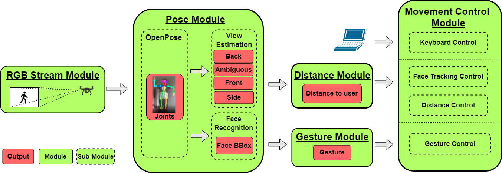

# Pose2Drone
Original Implementation of the paper, Zdravko Marinov, Stanka Vasileva, Qing Wang, Constantin Seibold, Jiaming Zhang, and Rainer Stiefelhagen: "Pose2Drone: A Skeleton-Pose-based Framework forHuman-Drone Interaction", EUSIPCO 2021, TBD publication link

## Framework Overview

## Gestures Overview

